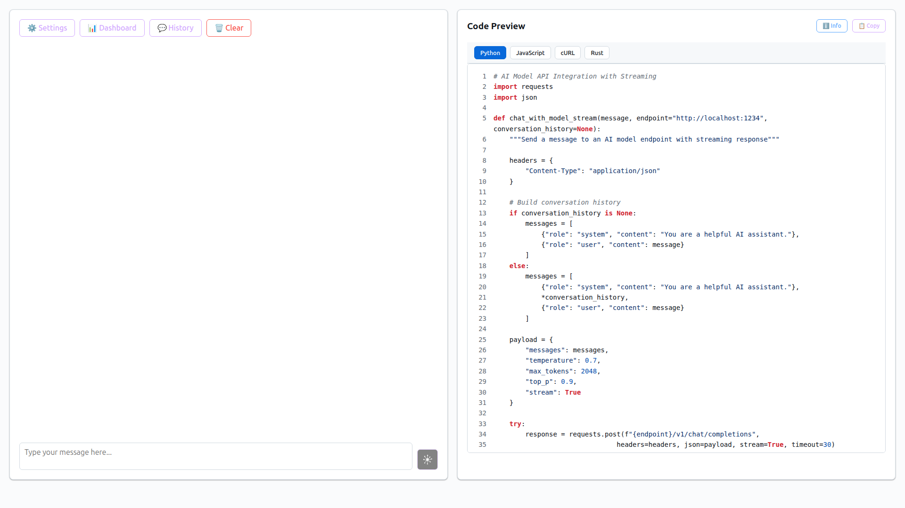
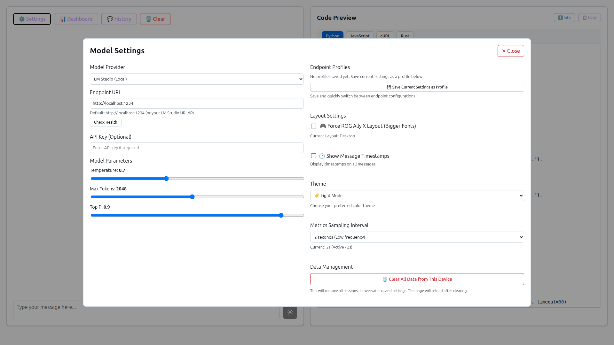
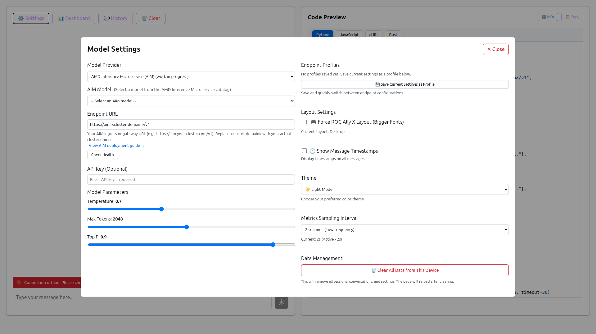
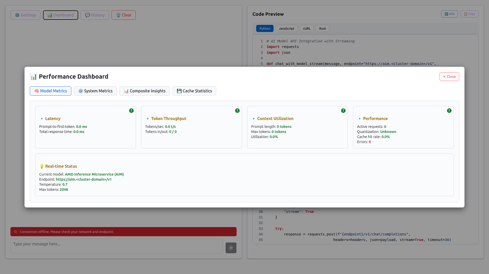
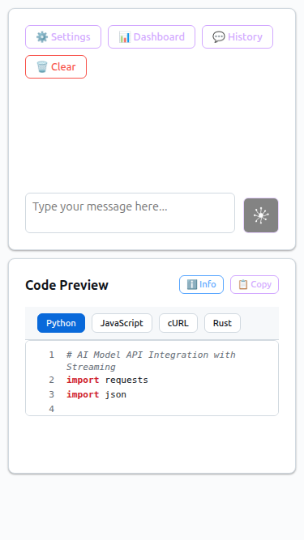
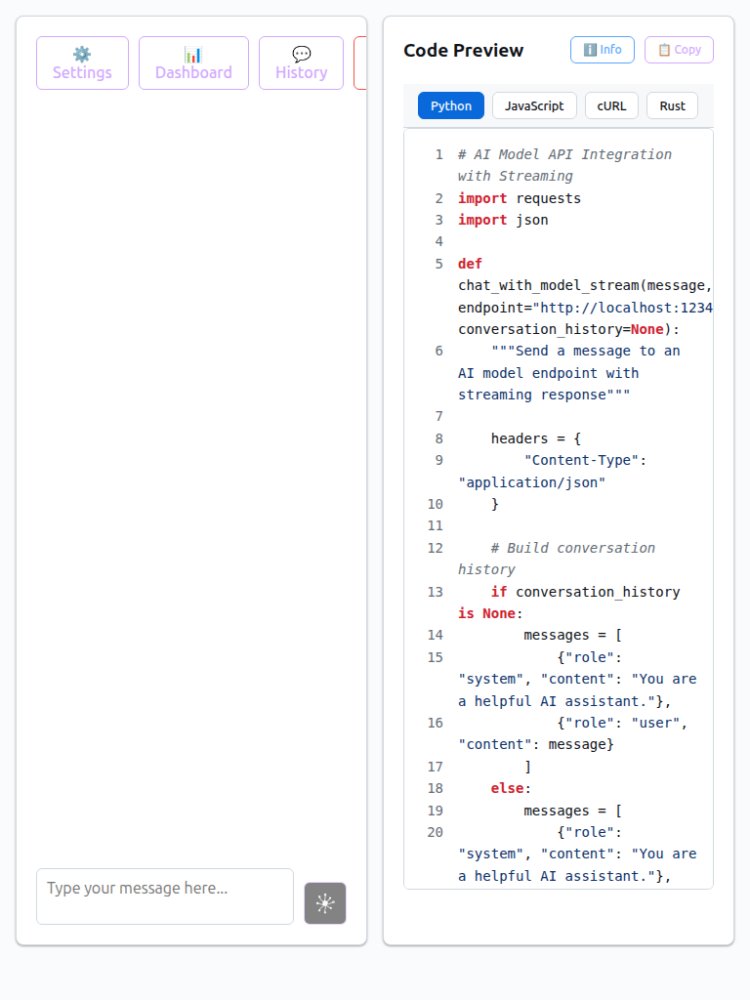
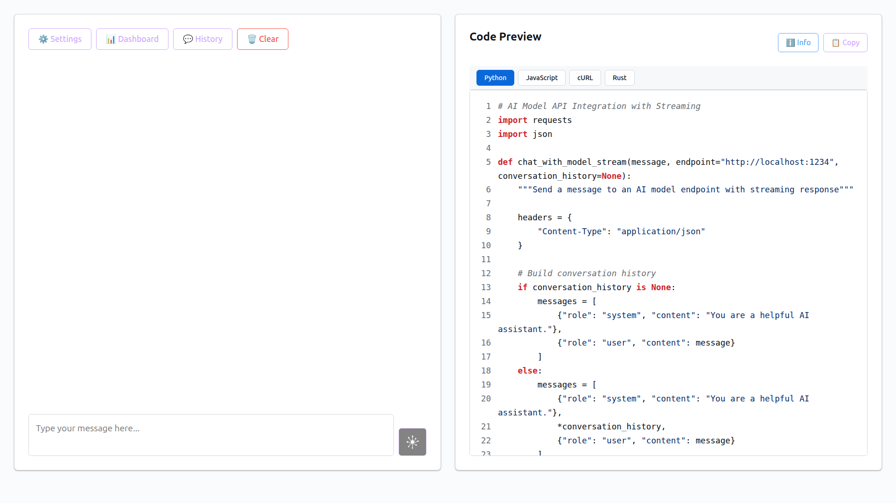

# Multiverse - AI Model Playground

<div align="center">
  
</div>

A simplified, responsive AI model playground for testing different AI models across multiple devices.

[](../../actions/workflows/ci.yml)
[](LICENSE)

## Screenshots

<div align="center">
  
  <p><em>Desktop layout with full two-column interface</em></p>
</div>

<div align="center">
  
  <p><em>Settings modal with two-column layout</em></p>
</div>

<div align="center">
  
  <p><em>Settings modal showing AMD Inference Microservice (AIM) integration</em></p>
</div>

<div align="center">
  
  <p><em>Performance dashboard with real-time metrics</em></p>
</div>

<div style="display: flex; justify-content: space-around; flex-wrap: wrap; gap: 20px; margin: 20px 0;">
  <div>
    
    <p align="center"><em>Mobile</em></p>
  </div>
  <div>
    
    <p align="center"><em>Tablet</em></p>
  </div>
  <div>
    
    <p align="center"><em>ROG Ally X</em></p>
  </div>
</div>

## Features

- **Multi-Device Support**: Responsive design for desktop, tablet, and mobile (including ROG Ally X)
- **Multiple Model Support**: LM Studio, Ollama, custom OpenAI-compatible endpoints, and **AMD Inference Microservice (AIM)**
- **Real-time Streaming**: Live streaming responses with thinking vs response detection
- **Interactive Chat**: Multi-turn conversations with context preservation
- **Code Generation**: Auto-generates Python integration code
- **Parameter Control**: Temperature, max tokens, top-p, and API key configuration
- **GPU Support**: Comprehensive GPU monitoring and optimization, including **AMD MI300X** support

## Quick Start

### Option 1: Try with Mock Server (No LLM Required)

Perfect for testing the UI without setting up a real LLM:

```bash
# 1. Install dependencies
npm install

# 2. Start mock LLM server (terminal 1)
npm run mock-server

# 3. Start dev server (terminal 2)
npm run dev

# 4. Open http://localhost:5173 in your browser
```

### Option 2: Use with Real LLM

1. **Install dependencies:**
   ```bash
   npm install
   ```

2. **Start your LLM server:**
   - **LM Studio**: Start local server on port 1234
   - **Ollama**: Run `ollama serve` (port 11434)

3. **Start development server:**
   ```bash
   npm run dev
   ```

4. **Open in browser:**
   - Navigate to `http://localhost:5173`
   - Configure your model endpoint in Settings
   - Start chatting!

## 🧪 Try It - Known-Good Endpoints

### LM Studio (Recommended for Beginners)
- **Endpoint**: `http://localhost:1234`
- **Setup**: [Download LM Studio](https://lmstudio.ai/), load a model, start server
- **Test Prompt**: "Write a hello world program in Python"

### Ollama (For CLI Users)
- **Endpoint**: `http://localhost:11434`
- **Setup**: `curl -fsSL https://ollama.ai/install.sh | sh && ollama pull llama2`
- **Test Prompt**: "Explain what a REST API is"

### Mock Server (No LLM Needed)
- **Endpoint**: `http://localhost:1234`
- **Setup**: `npm run mock-server`
- **Test Prompt**: Any message - returns simulated responses

All endpoints are OpenAI API compatible and support streaming.

## Device Compatibility

- **Desktop**: Full two-column layout with all features
- **Tablet**: Optimized two-column layout
- **Mobile/Handheld**: Single-column layout (perfect for ROG Ally X)

## Backend Metrics Service

Multiverse includes an optional backend service for real-time, accurate system metrics:

### Features
- **Real-time Metrics**: WebSocket connection for live system metrics
- **NVIDIA GPU Support**: Integration with `nvidia-smi` via `pynvml`
- **AMD ROCm Support**: Integration with `rocm-smi` for AMD GPUs
- **CPU & Memory**: Accurate metrics via `psutil`
- **Battery Metrics**: Real-time battery monitoring (laptops)
- **Automatic Fallback**: Falls back to browser metrics if backend unavailable

### Setup

**Important**: Use a virtual environment to avoid conflicts with system packages.

1. **Start the backend service (recommended):**
   ```bash
   cd backend
   ./start.sh
   ```
   
   The script will automatically:
   - Create a virtual environment
   - Install all dependencies
   - Start the server

2. **Or set up manually:**
   ```bash
   cd backend
   python3 -m venv venv
   source venv/bin/activate  # On Linux/Mac
   pip install -r requirements.txt
   python metrics_server.py
   ```

3. **The frontend will automatically connect** to `http://localhost:8000`

**Note**: If you get an error about `python3-venv` not being installed:
   ```bash
   sudo apt install python3-venv  # On Ubuntu/Debian
   ```

### API Endpoints
- **WebSocket**: `ws://localhost:8000/ws/metrics` - Real-time metrics stream
- **HTTP**: `http://localhost:8000/api/metrics` - One-time metrics fetch
- **Health**: `http://localhost:8000/api/health` - Health check

### Optional Dependencies
- **NVIDIA**: Requires `pynvml` and NVIDIA drivers
- **AMD ROCm**: Requires `rocm-smi` in PATH
- **Battery**: Only available on laptops

The frontend gracefully falls back to browser-based metrics if the backend is unavailable.

## GPU Support

Multiverse includes comprehensive GPU monitoring and optimization support:

### AMD MI300X Support

The project now includes full support for **AMD Instinct™ MI300X** accelerators:

- **Automatic Detection**: Detects MI300X GPUs using ROCm (rocm-smi)
- **MI300X-Specific Metrics**:
  - 192 GB HBM3 memory monitoring
  - 5.3 TB/s memory bandwidth tracking
  - 304 CDNA compute units utilization
  - Real-time temperature and power monitoring
- **Optimization Recommendations**: MI300X-specific performance tuning suggestions
- **ROCm Integration**: Uses rocm-smi for accurate GPU metrics

#### MI300X Specifications Tracked:
- **Memory**: 192 GB HBM3 with 5.3 TB/s bandwidth
- **Compute**: 304 AMD CDNA™ GPU Compute Units
- **Performance**: Up to 81.7 TFLOPS (FP64) / 163.4 TFLOPS (FP32)

#### Using MI300X Detection:

1. **Install ROCm** (if not already installed):
   ```bash
   # Follow AMD ROCm installation guide for your system
   # https://rocm.docs.amd.com/
   ```

2. **Run GPU Detection Script**:
   ```bash
   python3 scripts/detect-mi300x.py
   ```

3. **View GPU Metrics**: The dashboard automatically displays MI300X-specific information when detected

### Other GPU Support

Multiverse also supports:
- **NVIDIA GPUs**: A100, H100, RTX series (via nvidia-smi)
- **AMD GPUs**: MI250X, MI210, and other ROCm-compatible GPUs
- **Generic GPUs**: Basic metrics for any detected GPU

### GPU Metrics Dashboard

The system metrics dashboard shows:
- GPU utilization and memory usage
- Temperature and power consumption
- GPU-specific optimizations and recommendations
- Real-time performance insights

## Generated Code

The app generates clean, production-ready Python code with:
- Streaming support
- Interactive chat loops
- Error handling
- Conversation history management

## Development

Built with:
- React 19
- TypeScript
- Vite
- Responsive CSS Grid

### Running Tests

```bash
# Install Playwright browsers (first time only)
npx playwright install

# Run tests
npm test

# Run tests with UI
npm run test:ui

# View test report
npm run test:report
```

### Project Structure

```
Multiverse/
├── src/              # React app source
│   ├── metrics.ts    # Full metrics collection (includes MI300X support)
│   ├── simple-metrics.ts  # Simplified metrics
│   └── basic-metrics.ts   # Basic metrics
├── tests/            # Playwright tests
├── scripts/          # Helper scripts
│   ├── mock-llm-server.js  # Mock LLM server
│   └── detect-mi300x.py    # MI300X GPU detection script
├── .github/          # CI/CD workflows
```

## Documentation

- 🚀 [Quick Start Guide](QUICKSTART.md) - Get running in 5 minutes

## License

Apache License 2.0
