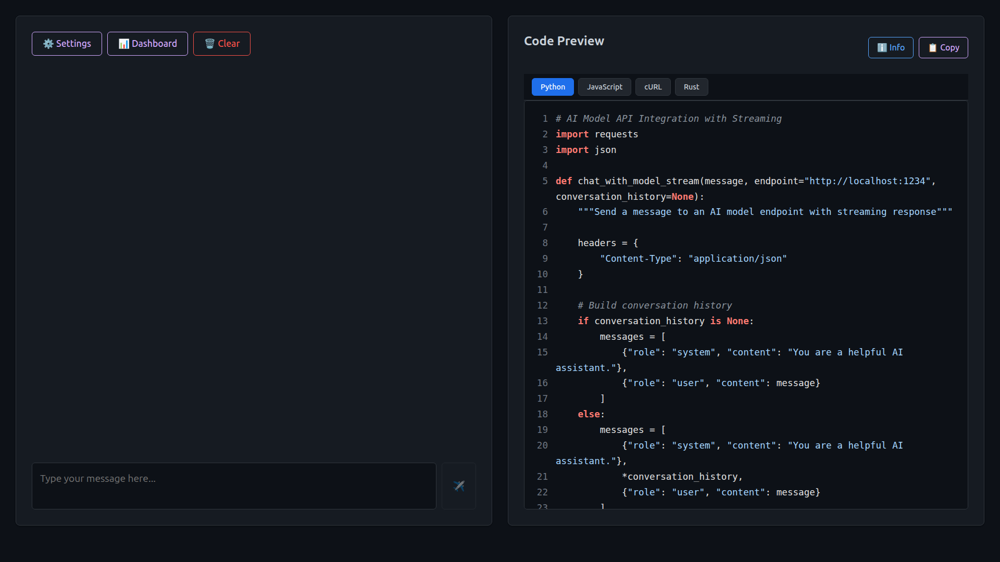
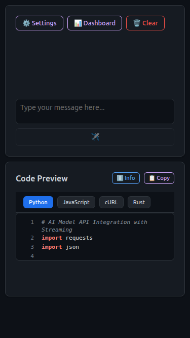

# Proof of Working - Multiverse AI Playground

This document provides evidence that the Multiverse AI Playground actually runs and works as intended.

## 🎥 Video Demo

> **[30-second Loom video coming soon]**  
> Shows the app loading, connecting to LM Studio, sending a prompt, and receiving a streaming response.

### How to Record Your Own Demo Video

1. **Install Loom**: [https://www.loom.com/](https://www.loom.com/)
2. **Start the app**: Run `npm run dev` and `npm run mock-server` (or use a real LLM)
3. **Record a 30-second demo** showing:
   - App loading at http://localhost:5173
   - Opening Settings and configuring endpoint
   - Sending a test prompt (e.g., "Write a hello world in Python")
   - Showing the streaming response
   - Code panel updating with generated code
   - (Optional) Dashboard showing metrics
4. **Upload to Loom** and add the link above

**Script suggestion**:
- 0:00-0:05 - "Here's Multiverse AI Playground running locally"
- 0:05-0:10 - Show settings with endpoint configuration
- 0:10-0:20 - Type and send a prompt, watch streaming response
- 0:20-0:25 - Show generated code in the panel
- 0:25-0:30 - "It works on desktop, tablet, and ROG Ally X!"

## 📸 Screenshots

### Automated Screenshot Capture

Capture all layout screenshots automatically:

```bash
# Make sure the app is running
npm run dev

# In another terminal, capture screenshots
npm run screenshots
```

This will generate:
- `docs/screenshots/desktop.png` - Desktop 1920x1080
- `docs/screenshots/rog-ally-x.png` - ROG Ally X layout
- `docs/screenshots/mobile.png` - Mobile 375x667
- `docs/screenshots/tablet.png` - Tablet 768x1024
- `docs/screenshots/settings-modal.png` - Settings UI
- `docs/screenshots/dashboard-modal.png` - Dashboard UI

### Manual Screenshot Tips

If you prefer to capture manually:
1. Open browser dev tools (F12)
2. Toggle device toolbar (Ctrl+Shift+M)
3. Select preset device or set custom dimensions
4. Take screenshot (right-click → "Capture screenshot")

### Desktop Layout

*Full two-column layout with chat on the left and code generation on the right*

### ROG Ally X / Handheld Layout

*Optimized layout for gaming handhelds with larger fonts and touch-friendly controls*

### Mobile Layout

*Single-column responsive layout for phones*

## ✅ Automated Tests

This project includes automated tests that run on every commit via GitHub Actions:

- **Build Test**: Ensures the project compiles without errors
- **Lint Test**: Checks code quality
- **Playwright Smoke Tests**: Verifies UI components render correctly

[](../../actions/workflows/ci.yml)

### Running Tests Locally

```bash
# Install dependencies
npm install

# Install Playwright browsers
npx playwright install

# Start mock LLM server (in one terminal)
node scripts/mock-llm-server.js

# Run tests (in another terminal)
npx playwright test

# View test report
npx playwright show-report
```

## 🧪 Try It Yourself

### Quick Start with Mock Server

If you don't have LM Studio or Ollama installed, you can test the UI with our mock server:

```bash
# 1. Clone the repo
git clone https://github.com/yourusername/Multiverse.git
cd Multiverse

# 2. Install dependencies
npm install

# 3. Start the mock LLM server (terminal 1)
node scripts/mock-llm-server.js

# 4. Start the dev server (terminal 2)
npm run dev

# 5. Open http://localhost:5173 in your browser
```

The mock server simulates OpenAI-compatible responses without needing a real LLM.

### Try with Real Models

#### Option 1: LM Studio (Recommended for Beginners)

1. **Download LM Studio**: [https://lmstudio.ai/](https://lmstudio.ai/)
2. **Load a model**: Try `TheBloke/Llama-2-7B-Chat-GGUF` or any other model
3. **Start the local server**: 
   - Click "Local Server" tab in LM Studio
   - Click "Start Server" (default port: 1234)
4. **Run Multiverse**:
   ```bash
   npm install
   npm run dev
   ```
5. **Send a test prompt**: Try "Write a hello world program in Python"

**Expected result**: You should see streaming responses appear in real-time.

#### Option 2: Ollama (For CLI Users)

1. **Install Ollama**: 
   ```bash
   curl -fsSL https://ollama.ai/install.sh | sh
   ```
2. **Pull a model**:
   ```bash
   ollama pull llama2
   ```
3. **Start Ollama** (it auto-starts, but verify):
   ```bash
   ollama serve
   ```
4. **Configure Multiverse**:
   - Open Settings in the app
   - Select "Ollama (Local)"
   - Endpoint should be `http://localhost:11434`
5. **Send a test prompt**: Try "Explain what a REST API is"

**Expected result**: Streaming responses from Ollama's model.

### Known-Good Test Prompts

Try these to verify everything works:

1. **Basic Test**:
   ```
   Hello, can you introduce yourself?
   ```
   *Expected: A brief introduction from the model*

2. **Code Generation**:
   ```
   Write a Python function to calculate fibonacci numbers
   ```
   *Expected: Python code appears, and the code preview panel updates*

3. **Multi-turn Conversation**:
   ```
   Prompt 1: What is machine learning?
   Prompt 2: Can you give me an example?
   ```
   *Expected: Context is maintained between messages*

## 🏗️ Build Verification

To verify the production build works:

```bash
# Build for production
npm run build

# Preview the production build
npm run preview
```

The build should complete without errors and the preview should work identically to dev mode.

## 📊 CI/CD Pipeline

Our GitHub Actions workflow automatically:

1. ✅ Checks out the code
2. ✅ Sets up Node.js 20.19.0 (via .nvmrc)
3. ✅ Installs dependencies
4. ✅ Lints the code
5. ✅ Builds the project
6. ✅ Starts the mock LLM server
7. ✅ Runs Playwright smoke tests
8. ✅ Uploads test reports

See [.github/workflows/ci.yml](.github/workflows/ci.yml) for the full configuration.

## 🐛 Troubleshooting

### Issue: "Connection failed" error

**Solutions**:
- Verify your LLM server is actually running
- Check the endpoint URL in Settings matches your server
- Try the mock server first to rule out configuration issues
- Check browser console for detailed error messages

### Issue: Mock server doesn't start

**Solutions**:
- Ensure port 1234 isn't already in use
- Try a different port: `MOCK_LLM_PORT=8080 node scripts/mock-llm-server.js`
- Check Node.js version: `node --version` (should be 20.x)

### Issue: Tests fail

**Solutions**:
- Make sure the mock server is running before tests
- Install Playwright browsers: `npx playwright install`
- Clear node_modules and reinstall: `rm -rf node_modules && npm install`

## 📦 What's Included

This proof-of-work package includes:

- `.nvmrc` - Pins Node.js to 20.19.0
- `.github/workflows/ci.yml` - GitHub Actions CI pipeline
- `playwright.config.ts` - Playwright test configuration
- `tests/smoke.spec.ts` - Comprehensive UI smoke tests
- `scripts/mock-llm-server.js` - OpenAI-compatible mock endpoint
- `README_PROOF.md` - This file!

## 🎯 Next Steps

After verifying the app works:

1. **Customize settings**: Adjust temperature, max tokens, and other parameters
2. **Try different models**: Test with various LLM models
3. **Generate code**: Use the code preview panel to export your API integration
4. **Test on ROG Ally X**: If you have one, try the handheld layout
5. **Contribute**: Found a bug or want to add a feature? PRs welcome!

## 📝 License

Apache License 2.0 - See [LICENSE](LICENSE) for details.

---

**Questions?** Open an issue on GitHub or check the main [README.md](README.md) for more info.

